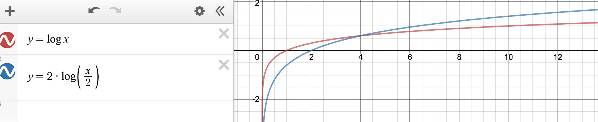

## Problem Statement
Design a class to calculate the median of a number stream. The class should have the following two methods:
- insertNum(int num): stores the number in the class
- findMedian(): returns the median of all numbers inserted in the class

If the count of numbers inserted in the class is even, the median will be the average of the middle two numbers.

## Runtime analysis
Here the two-heap solution's run time is O(2*log(N/2)), since in the worst case
we need to insert a number into a heap twice and the maximum size of a heap is N/2.

Comparing to the binary-sort-on-lniked-list solution, which has a runtime of
O(log(N)). We could see from the runtime diagram below, that binary sort on 
lniked list solution is actually faster in terms of the worst case. 

Also, both cases consume a space O(N).

